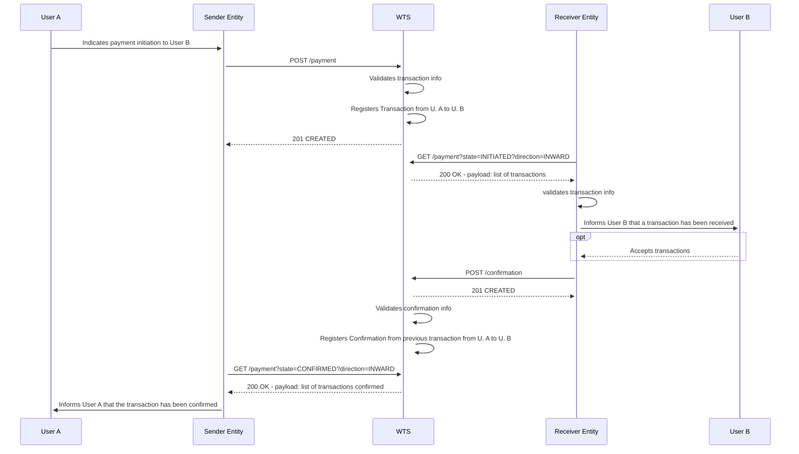

```mermaid
sequenceDiagram
    User A->>+Sender Entity: Indicates payment initiation to User B
    Sender Entity->>+WTS: POST /payment
    WTS ->>+WTS: Validates transaction info
    WTS->>+WTS: Registers Transaction from U. A to U. B
    WTS-->>+Sender Entity: 201 CREATED
    Receiver Entity->>+WTS: GET /payment?state=INITIATED?direction=INWARD
    WTS-->>+Receiver Entity: 200 OK - payload: list of transactions
    Receiver Entity->>+Receiver Entity: validates transaction info
    Receiver Entity->>+User B: Informs User B that a transaction has been received
    opt
    User B-->>+Receiver Entity: Accepts transactions
    end
    Receiver Entity->>+WTS: POST /confirmation
    WTS-->>+Receiver Entity: 201 CREATED
    WTS ->>+WTS: Validates confirmation info
    WTS ->>+WTS: Registers Confirmation from previous transaction from U. A to U. B
    Sender Entity->>+WTS: GET /payment?state=CONFIRMED?direction=INWARD
    WTS-->>+Sender Entity: 200 OK - payload: list of transactions confirmed
    Sender Entity->>+User A: Informs User A that the transaction has been confirmed
```